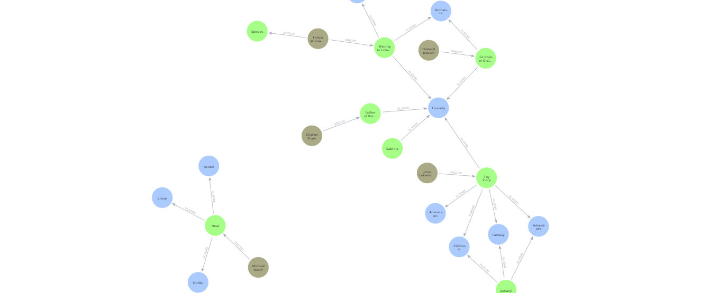

# 🔗 NeoGraph Query Engine: LLM-Powered Cypher Generation for Neo4j

**NeoGraph Query Engine** demonstrates how to leverage a Large Language Model (LLM) to generate **Cypher queries** for a **Neo4j graph database**. This project uses Langchain to construct a chain that takes a natural language question, converts it into a Cypher query, executes it against a Neo4j movie database, and returns the result. It showcases various prompt engineering strategies to improve the accuracy and efficiency of the LLM in generating valid and relevant Cypher queries.


*(This image depicts the overall flow: a user question is processed by an LLM to generate a Cypher query, which is then run against the Neo4j database to fetch results.)*

---
## 🚀 Features

* **Natural Language to Cypher**: Converts user questions in natural language into executable Cypher queries.
* **Neo4j Integration**: Connects to a Neo4j graph database to execute queries and fetch real-time data.
* **Langchain Powered**: Utilizes the `GraphCypherQAChain` from Langchain to manage the query generation and execution process.
* **LLM Integration via Groq**: Uses an LLM (e.g., `your_groq_compatible_model_name_here` via the **Groq API**) to understand the question and generate Cypher.
* **Prompt Engineering Examples**:
    * **Schema-Aware Prompts**: Includes the database schema in the prompt to help the LLM generate more accurate queries.
    * **Few-Shot Learning**: Provides examples of question-Cypher pairs in the prompt to guide the LLM.
    * **Custom Prompt Templates**: Demonstrates the use of `PromptTemplate` for structuring the input to the LLM.
* **Validation & Error Handling**: Shows examples of how the chain attempts to handle Cypher validation and potential errors.
* **Visualizations**: Includes example graph visualizations that could represent the query paths or results.

---
## ⚙️ How it Works

The core of the project is the `GraphCypherQAChain`, which orchestrates the following steps:

1.  **Input**: A user poses a question in natural language (e.g., "How many movies has Tom Hanks acted in?").
2.  **Prompt Construction**:
    * The chain incorporates the database **schema** (node labels, relationships, properties) into a prompt. This gives the LLM context about the graph's structure.
    * Optionally, **few-shot examples** (predefined question-Cypher pairs) can be added to the prompt to further guide the LLM.
    * The user's **question** is also added to this prompt.
3.  **Cypher Generation**: The complete prompt is sent to the LLM (via Groq). The LLM's task is to generate a Cypher query that, when executed, will answer the user's question.
4.  **Query Execution**: The generated Cypher query is automatically run against the connected Neo4j database.
5.  **Result Retrieval**: The data retrieved from the database is then returned. The notebook shows examples where the chain might also attempt to synthesize a natural language answer from this data or indicate if it cannot answer.

The notebook explores different ways to refine the prompt to improve the quality of the generated Cypher queries, such as providing more detailed schema information or curated examples.

---
## 📋 Requirements

* Python 3.x
* Jupyter Notebook or an IDE that supports `.ipynb` files
* Access to a Neo4j Aura database or a local Neo4j instance.
* **Groq API Key**.
* Required Python libraries: `langchain`, `langchain_community`, `langchain_neo4j`, `langchain_groq`, `neo4j`, `python-dotenv`, `tiktoken`.

---
## 🛠️ Setup & Installation

1.  **Clone the repository (if applicable, or download the `.ipynb` file and images).**

2.  **Create a virtual environment (recommended):**
    ```bash
    python -m venv venv
    source venv/bin/activate  # On Windows use `venv\Scripts\activate`
    ```

3.  **Install the required Python libraries:**
    ```bash
    pip install langchain langchain_community langchain_neo4j langchain_groq neo4j python-dotenv tiktoken
    ```

4.  **Set up Neo4j Database:**
    * Ensure your Neo4j database is running and accessible. The notebook uses a pre-populated movie database.
    * Update the Neo4j connection details in the notebook or use environment variables. The script sets these from hardcoded values initially:
        ```python
        NEO4J_URI = "neo4j+s://ab41c641.databases.neo4j.io" #
        NEO4J_USERNAME = "neo4j" #
        NEO4J_PASSWORD = "your_neo4j_password_here" # Replace with your actual password
        ```
        These are then set as environment variables within the script. **It's crucial to replace `"your_neo4j_password_here"` with your actual Neo4j password.**

5.  **Set up Groq API Key:**
    * Obtain an API key from Groq.
    * Set it as an environment variable:
        ```bash
        export GROQ_API_KEY="your_groq_api_key_here"
        ```
        Or add it to a `.env` file and ensure your script loads it (e.g., using `python-dotenv` and calling `load_dotenv()` at the beginning of your script/notebook). The Langchain Groq LLM wrapper will typically look for this environment variable.

---
## ▶️ Usage

1.  **Open the Jupyter Notebook:**
    ```bash
    jupyter notebook promptstatergies.ipynb
    ```
    Or open it with your preferred IDE.

2.  **Configure Credentials**:
    * Ensure your Neo4j URI, username, and especially your **Neo4j password** are correctly set in the initial cells where `NEO4J_PASSWORD` is defined.
    * Make sure your `GROQ_API_KEY` environment variable is set and accessible by the notebook environment.

3.  **Run the Cells Sequentially:**
    * The notebook starts by setting up Neo4j credentials and initializing the `Neo4jGraph` instance.
    * It then demonstrates various ways to construct the `GraphCypherQAChain` using an LLM from Groq (e.g., `ChatGroq` with your chosen model).
        * Basic chain with schema.
        * Chain with few-shot examples.
        * Chain with custom prompt templates for more control.
    * Each demonstration involves invoking the chain with a sample question and observing the generated Cypher query and the final result.

4.  **Experiment with Questions and Prompts:**
    * Modify the `chain.invoke("Your question here")` calls to ask different questions about the movie database.
    * Adjust the custom prompt templates or few-shot examples to see how they impact the LLM's Cypher generation.

---
## 💡 Prompt Engineering Strategies Explored

The notebook highlights several techniques to improve LLM performance for Cypher generation:

* **Providing Schema Context**: Supplying the graph schema (node labels, relationship types, and properties) helps the LLM understand the database structure and generate valid queries.
* **Few-Shot Learning**: Including a few examples of natural language questions and their corresponding correct Cypher queries in the prompt can significantly improve the LLM's ability to generalize and produce accurate queries for new questions.
* **Customizing Prompts**: Using `PromptTemplate` allows for fine-grained control over the information and instructions provided to the LLM, enabling more complex or nuanced query generation.

---